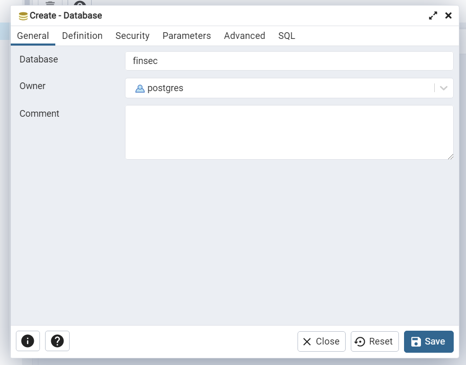

# FINSEC Website Backend

## Description

This is the backend repository for FINSEC Website project, initialised in NUSSU CommIT's Technical 32nd Committee (AY2023/2024)

The backend for FINSEC Website project uses Django with REST API implementation. Project tasks and backlogs are documented through GitHub Issues and GitHub Projects.

Technical documentation can be found through the following link:

[Google Drive link for Technical Docs](https://drive.google.com/drive/folders/10EQEf3yuh1ZCoSM0riLSmXGY6Rpb6rIa?usp=drive_link)


## Setting up: Ubuntu (or WSL)

This guide is built with **Ubuntu environment on Windows (or WSL)** in mind. If you are a windows user, you can follow through the following commands by first opening your Ubuntu terminal or using your WSL.

### Download Ubuntu

1. Download **Ubuntu 22.04.2 LTS** in Microsoft Store
2. Open Windows PowerShell as an administrator
3. Start the Ubuntu WSL shell

### Update Packages

1. Update your package repository, upgrade existing packages, and reboot

```
$ sudo apt update
$ sudo apt upgrade
$ reboot
```

2. (If you haven't done so) Install PIP, the Python package manager and Virtual Environment module. Install Git as well

```
$ sudo apt install python3-pip python3-venv
$ sudo apt install git
```

### Install and Setup PostgreSQL

1. Import the PostgreSQL repository key, and add the repository

```
$ sudo apt install curl ca-certificates gnupg
$ curl https://www.postgresql.org/media/keys/ACCC4CF8.asc | gpg --dearmor | sudo tee /etc/apt/trusted.gpg.d/apt.postgresql.org.gpg >/dev/null
$ echo "deb http://apt.postgresql.org/pub/repos/apt/ `lsb_release -cs`-pgdg main" | sudo tee /etc/apt/sources.list.d/pgdg.list
$ sudo apt update
```

2. Install **PostgreSQL 14**.
(Why 14?) because currently my internship uses 14 and I'm too lazy to have to store 2 postgres versions in my ubuntu terminal :(

```
$ sudo apt install postgresql-14 postgresql-client-14
```

3. Start the PostgreSQL service on your computer

```
$ sudo service postgresql start
```

Note: this command is unique for Windows WSL users. If you are using "pure" Ubuntu (Linux OS), please use `sudo systemctl start postgresql` instead.

4. Log in as the Postgres superuser

```
$ sudo su - postgres
```

5. Start the Postgres interactive terminal

```
psql postgres
```

6. Create a database called `finsec` on Postgres, then create a user and grant it privileges to modify and write to the database

```
# CREATE DATABASE finsec;
# CREATE USER finsecuser WITH PASSWORD 'finsec';
# GRANT ALL PRIVILEGES ON DATABASE finsec TO finsecuser;
```

7. `CTRL-D` to exit the Postgres shell, and `CTRL-D` to logout of the Postgres superuser

### Create a Virtual Environment and Install Requirements

1. Navigate to the directory of the cloned repository

2. Create a Python Virtual Environment

```
$ python3 -m venv env
```

3. Activate the Virtual Environment

```
$ source env/bin/activate
```

4. Install the required packages.

```
$ pip install -r requirements.txt
```

### Create Admin User

1. Run in terminal

```
$ python3 manage.py createsuperuser
```

2. Enter username and password

### Setup and Run the Django Backend

1. Get a copy of the `.env` file from another team member. Place the `.env` file in the `finsec_website_backend` folder

Ideally, the folder should have the following structure. 

```
finsec_website_backend
├── api
├── finsec_website_backend
│   ├── __init__.py
│   ├── __pycache__
|   ├── .env
│   ├── asgi.py
│   ├── settings.py
│   ├── urls.py
│   └── wsgi.py
├── DeveloperGuide.md
├── manage.py
└── requirements.txt
```

Note that this structure is taken at the time this README is created. However, I believe that the inner `finsec_website_backend` folder should remain untouched, as it won't be the main development app for Django.

2. Update your Postgres username and password in this file so Django can connect to your database

If you use the default user `finsecuser` and password `finsec`, then you don't have to modify the username anymore. However, you might be needing to update your PostgreSQL port. Check this accordingly with your system.

3. Run the database migrations needed for this project

```
$ python3 manage.py migrate
```

4. Run the local Django development server

```
$ python3 manage.py runserver
```

5. Using your browser or Postman, navigate to `localhost:8000/api/public` and see if it works

## Setting up: Windows (Powershell and pgAdmin, default Windows)

If you don't want to use an Ubuntu / WSL system, then it should work well also on regular Windows systems. Do note that however, Windows might not entirely support backend development for more complex features (e.g. when `redis`/`celery` would be used for distributed infrastructure), thus it is recommended to refer to the Ubuntu/WSL development.

However, since the current iteration does not involve complex features that are not doable with a windows system, it is perfectly fine to use Windows (Powershell) for the current project.

### Install and Setup PostgreSQL

1. Install [PostgreSQL](https://www.enterprisedb.com/downloads/postgres-postgresql-downloads) on your computer. We recommend Postgres 14, however Postgres 15 works well too in this case. When setting up PostgreSQL, don't forget to tick the option to install pgAdmin for data visualisation.

2. Create a Postgres database
- Open pgAdmin 4 and login with your master password
- Right click on "Databases", and click on the "Create >> Database" option
- Name the database "Finsec" or any other name that you like, and click "Save"



### Create Virtual Environment and Install Requirements

1. Navigate to the repository after cloning

2. Create a Python Virtual Environment

```
$ python3 -m venv env
```

3. On your terminal (powershell/VSCode terminal), activate the Virtual Environment

```
$ ./env/Scripts/activate
```

4. Install the required packages

```
$ pip install -r requirements.txt
```

### Setup and Run the Django Backend

1. Get a copy of the `.env` file from another team member. Place the `.env` file in the `finsec_website_backend` folder

Ideally, the folder should have the following structure. 

```
finsec_website_backend
├── api
├── finsec_website_backend
│   ├── __init__.py
│   ├── __pycache__
|   ├── .env
│   ├── asgi.py
│   ├── settings.py
│   ├── urls.py
│   └── wsgi.py
├── DeveloperGuide.md
├── manage.py
└── requirements.txt
```

Note that this structure is taken at the time this README is created. However, I believe that the inner `finsec_website_backend` folder should remain untouched, as it won't be the main development app for Django.

2. Update your Postgres username and password in this file so Django can connect to your database. Change the username to `postgres` and the password to your postgres master password. You might also need to modify the Postgres port according to the port that Postgres is running on your computer.

3. Run the database migrations needed for this project

```
$ python3 manage.py migrate
```

4. Run the local Django development server

```
$ python3 manage.py runserver
```

5. Using your browser or Postman, navigate to `localhost:8000/api/public` and see if it works

## Setting up: MacOS

Cos of our frens who use MacOS (more superior than windows tho T_T)

### Create Virtual Environment and Install Requirements

1. Navigate to the repository after cloning

2. Create a Python Virtual Environment

```
$ python3 -m venv env
```

3. Activate the Virtual Environment

```
$ source env/bin/activate
```

4. Install the required packages

```
$ pip install -r requirements.txt
```

### Install and Setup PostgreSQL

1. If you are on MacOS, make sure you have the [Homebrew](https://brew.sh/) package manager installed.<br>
This is a legit gamechanger :O

2. Using Homebrew, install and start Postgres:

```
$ brew install postgresql
$ brew services start postgresql
```

3. Start the Postgres interactive terminal

```
$ psql postgres
```

4. Create a database called `finsec` on Postgres, then create a user and grant it privileges to modify and write to the database

```
# CREATE DATABASE finsec;
# CREATE USER finsecuser WITH PASSWORD 'finsec';
# GRANT ALL PRIVILEGES ON DATABASE finsec TO finsecuser;
```

5. `CTRL-D` to exit the Postgres shell.


### Setup and Run the Django Backend

1. Get a copy of the `.env` file from another team member. Place the `.env` file in the `finsec_website_backend` folder

Ideally, the folder should have the following structure. 

```
finsec_website_backend
├── api
├── finsec_website_backend
│   ├── __init__.py
│   ├── __pycache__
|   ├── .env
│   ├── asgi.py
│   ├── settings.py
│   ├── urls.py
│   └── wsgi.py
├── DeveloperGuide.md
├── manage.py
└── requirements.txt
```

Note that this structure is taken at the time this README is created. However, I believe that the inner `finsec_website_backend` folder should remain untouched, as it won't be the main development app for Django.

2. Update your Postgres username and password in this file so Django can connect to your database.

If you use the default user `finsecuser` and password `finsec`, then you don't have to modify the username anymore. However, you might be needing to update your PostgreSQL port. Check this accordingly with your system.

3. Run the database migrations needed for this project

```
$ python3 manage.py migrate
```

4. Run the local Django development server

```
$ python3 manage.py runserver
```

5. Using your browser or Postman, navigate to `localhost:8000/api/public` and see if it works


## Troubleshoot

### Error: Connection refused

Detailed error:
```
django.db.utils.OperationalError: connection to server at "localhost" (127.0.0.1), port 5434 failed: Connection refused
        Is the server running on that host and accepting TCP/IP connections?
```

Solution:
1. Check your PostgreSQL port using `sudo service postgresql status` for windows users, or `brew services list` for mac users.
2. If your port number (should be starting with 54..) is different from port 5434, update the `DB_PORT` variable in your `.env` file accordingly
